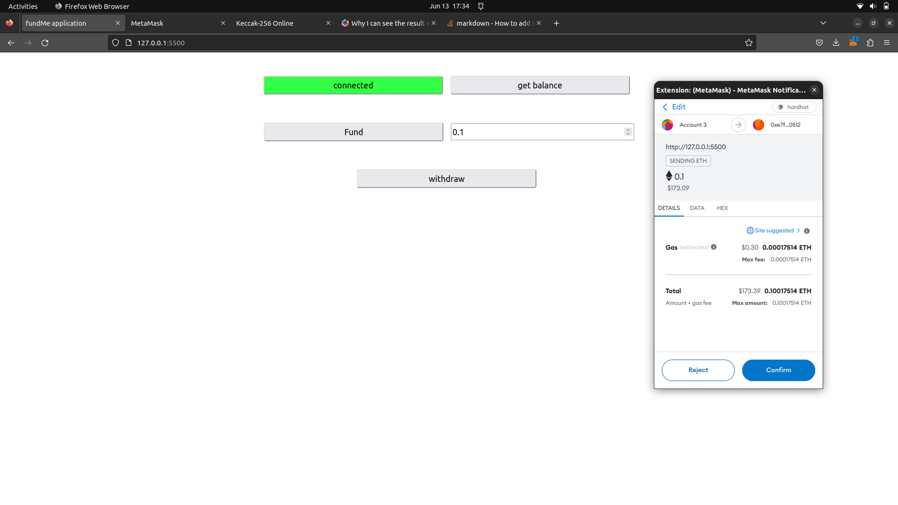
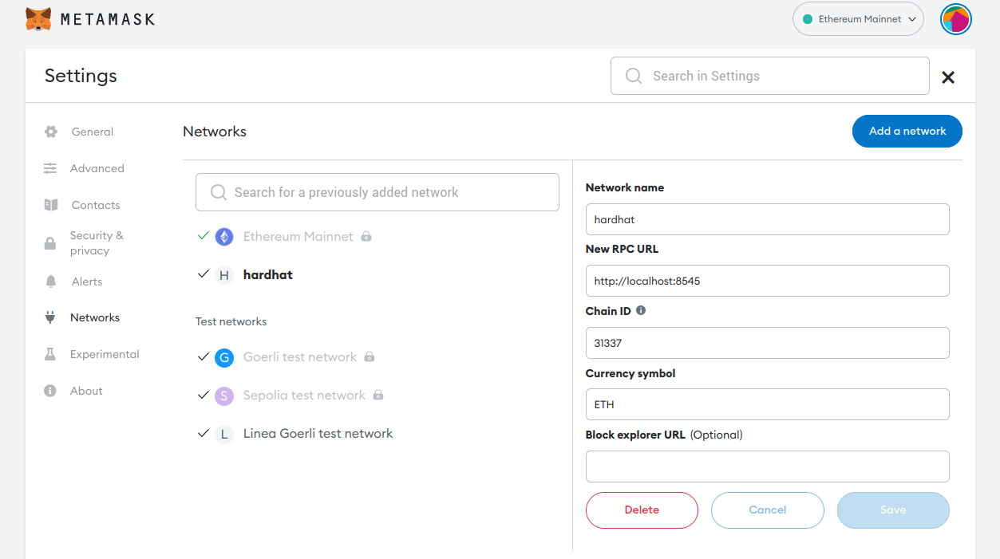

# Fund Me User interface

This is an abstract user interface project used to interact with the fundMe smart contract already pushed to the following [repository](https://github.com/yemingannouni/fundMe-hardhat-project).It is a brief demonstration of how you can connect your website to metamask wallet, and use a library like ethers.js to interact with a deployed contract.

<p align="center">

</p>

### Prerequisites

- [metamask extension](https://metamask.io/download/)

- the fundMe smart contract
  ```sh
  git clone https://github.com/yemingannouni/fundMe-hardhat-project
  ```
- live-sever extension in Vscode or
  ```sh
   npm i live-server
  ```

### Getting started

- add hardhat network to metamask

  

- Cd into the fundMe-hardhat-project and turn on the local hardhat node

```sh
   yarn hardhat node
```

- run live server and use your browser to connect to http://127.0.0.1:5500/
- click the connect button to connect your website to metamask and start interacting with the fundMe smart contract.
